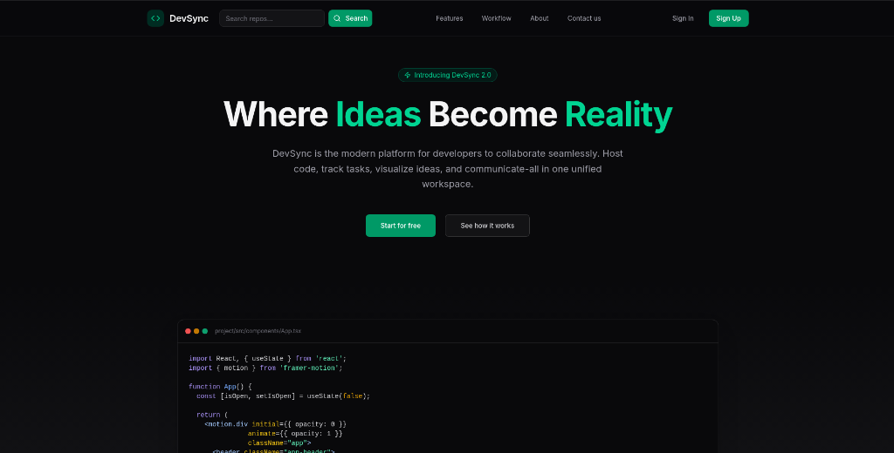

# DevSync 🚀

DevSync is a modern, collaborative code and project management platform. Designed for developers and teams, it combines code repository visualization, interactive task boards, real-time developer chat workspace, pull-request-like workflows, and comprehensive activity tracking into a unified experience.



---

## What is DevSync? 💡
DevSync is a collaborative code and project platform that provides project repositories, issues, tasks, pull-request-like workflows, a project whiteboard, and chat. The backend is a Django REST API and the frontend is a Vite + React + TypeScript app.

## Architecture & Tech Stack 🔧
- **Backend:** Django (REST API), apps include `authentication`, `projects`, `chats`, `notification` (`DevSync_Backend/`).
- **Frontend:** React + TypeScript + Vite (`DevSync_Frontend/`).
- **Local DB:** SQLite for development (no extra DB setup required).

---

## Getting Started 🚀

### Prerequisites
*   Python 3.11+
*   Node.js >= 18 and npm (or yarn/pnpm)
*   Git

### 1. Backend Setup (API & WebSockets)
```bash
# Navigate to the backend directory
cd DevSync_Backend

# Create and activate a virtual environment
python -m venv venv
source venv/bin/activate

# Install requirements
pip install -r ../backend_requirements.txt

# Run migrations
python manage.py migrate

# Create an administrator account (optional)
python manage.py createsuperuser

# Start the Daphne ASGI dev server
python manage.py runserver 0.0.0.0:8000
```
*The API and WebSockets server will run on `http://127.0.0.1:8000/`.*

### 2. Frontend Setup (Client)
```bash
# Navigate to the frontend directory
cd DevSync_Frontend

# Install node dependencies
npm install

# Start the Vite development server
npm run dev
```
*The client application will run on `http://localhost:5173/`.*

---

## Environment Configuration 🔒

Create a `.env` file in the root backend directory (`DevSync_Backend/`) to configure environment keys. Refer to `.env.example` if available.

### Essential Variables
*   `DJANGO_SECRET_KEY` — Private key for hashing and signing sessions.
*   `DJANGO_DEBUG` — Set to `False` in production.
*   `FRONTEND_URL` — Set to frontend application URL (default: `http://localhost:5173`).
*   `SOCIAL_GITHUB_CLIENT_ID` / `SOCIAL_GITHUB_SECRET` — GitHub OAuth client keys.
*   `EMAIL_HOST_USER` / `EMAIL_HOST_PASSWORD` — SMTP email relay credentials.

To generate a secure key for development, run:
```bash
python -c "from django.core.management.utils import get_random_secret_key; print(get_random_secret_key())"
```

---

## Testing & Validation ✅

*   **Run Backend Django Tests**:
    ```bash
    cd DevSync_Backend && python manage.py test
    ```
*   **Run Frontend TypeScript Checks & Linting**:
    ```bash
    cd DevSync_Frontend && npm run lint
    ```
